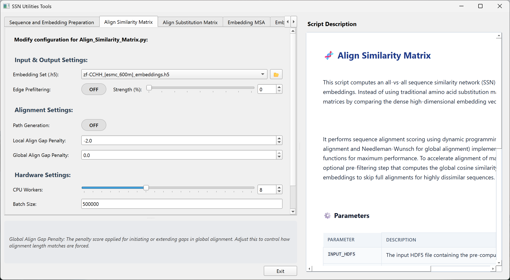
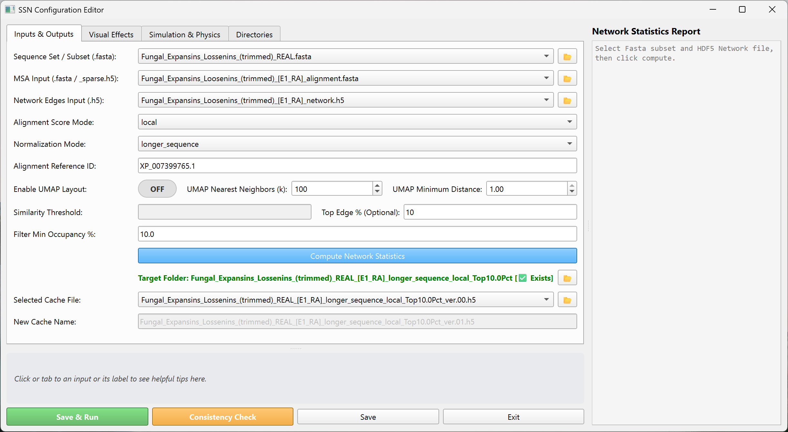
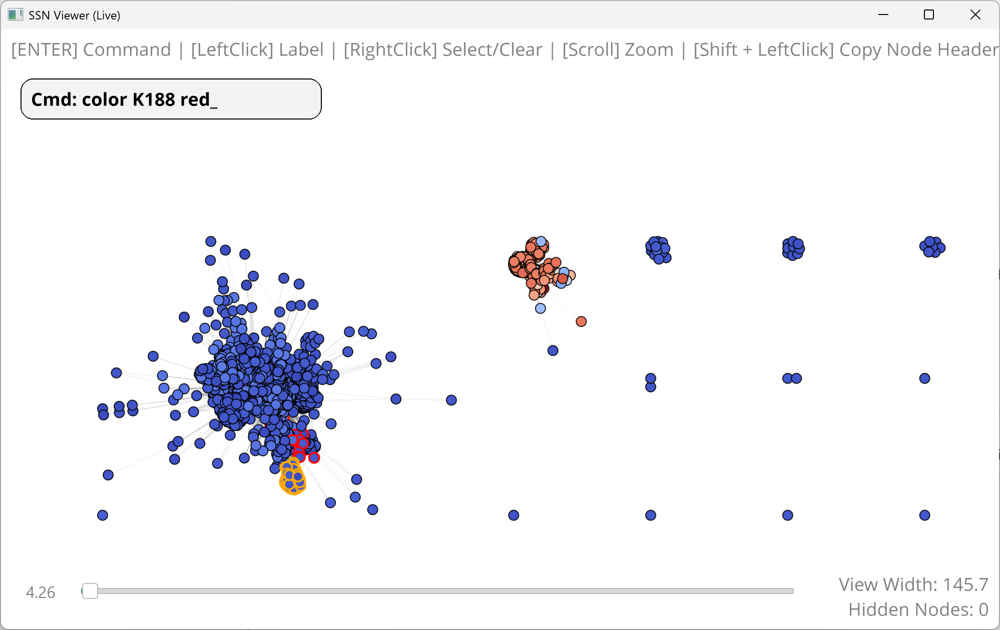
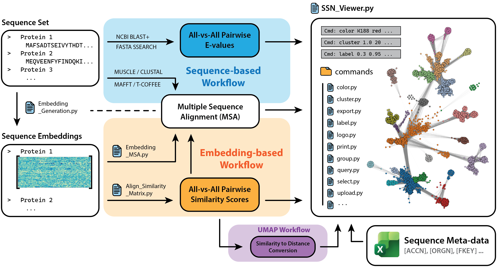

# Embedding-based Sequence Similarity Network (SSN) Viewer

[](https://www.python.org/)
[](https://github.com/)
[](LICENSE)
[](https://www.riverbankcomputing.com/software/pyqt/)
[](https://vispy.org/)

The **Embedding-based SSN Viewer (name: TBD)** is an interactive, high-performance graphical application designed to streamline the generation, visualization, and analysis of both traditional and embedding-based Sequence Similarity Networks (SSNs). By integrating **Multiple Sequence Alignments (MSAs)** directly into network exploration, the viewer bridges macroscopic sequence relationships with microscopic residue-level conservation, providing a comprehensive, multi-scale view of the protein sequence space.

---
## ⚠️ Important Note

1. **Cross-Platform Support**: Linux & macOS support is currently under active development.
2. **Work in Progress**: This documentation and the repository structure are undergoing active updates.
3. **Recommended Hardware**: An **NVIDIA GPU** is highly recommended for CUDA acceleration of embeddings and layout solvers. Intel Arc, AMD, and Apple Silicon GPUs are also supported via standard hardware acceleration backends.

---

## 📸 Overview

The application streamlines the entire SSN pipeline—from generation to interactive analysis—within a single unified workflow. It supports both traditional sequence similarity methods (e.g., BLAST) and modern embedding-based language model algorithms. Beyond dynamic visual formatting, the viewer provides an interactive command console with specialized commands tailored for deep analysis of the protein sequence space (see `list_of_commands.docx` for a detailed command reference).


---
## 🖥️ Graphical User Interface

### 🛠️ SSN Tools GUI

All calculations related to SSN generation are centralized in the `SSN_Tools.py` GUI. The interface is organized into intuitive tabs, each representing a distinct stage of the pipeline. It includes interactive tooltips at the bottom for parameter input fields and a script description panel on the right highlighting the function of each processing script.



### ⚙️ SSN Configuration GUI

The configuration GUI in `SSN_Config.py` simplifies input file selection and parameter tuning for SSN generation. It features a **Compute Network Statistics** utility that analyzes the network density and outputs a report in the right panel to guide the selection of an optimal similarity cutoff. Additionally, the **Consistency Check** utility compares the similarity network against the Multiple Sequence Alignment (MSA) to ensure sequence headers and indexes match perfectly across all files.



### 🔍 SSN Viewer GUI

The main visualization window, `SSN_Viewer.py`, serves as the interactive core for network exploration, formatting, and analysis. It provides full mouse and keyboard controls for 3D navigation and graphic customization, along with an in-line command console (HUD) to execute analytical operations, highlight specific residues, select clusters, and export figures.



---
## 🧬 System Workflow

The pipeline supports two primary pathways for Sequence Similarity Network (SSN) generation: a **traditional pathway** utilizing sequence alignment algorithms (like BLAST) and an **embedding-based pathway** driven by protein language models. Additionally, users can project sequences into 2D/3D space using UMAP based on pre-calculated embedding representations.



---

## 🚀 Key Features

*Work in Progress*

*   **Embedding-Based Dynamic Programming Alignment**: Align sequences using high-dimensional dense embedding similarity vectors instead of simple substitution matrices (BLOSUM/PAM), resolving structural and functional relationships even at low sequence identity.
*   **High-Performance Visualization**: Powered by PyQt6 and VisPy, allowing real-time rendering, rotation, zooming, and manipulation of large networks containing thousands of nodes and edges.
*   **Integrated Command Console (HUD)**: Execute analytical commands (such as `zoom`, `select`, `color`, `cluster`, `subcluster`, and `logo`) directly inside the viewer viewport for instant formatting and analysis.
*   **Integrated Multiple Sequence Alignments (MSA)**: Bridge macroscopic network topology with residue-level conservation. Map conservation scores directly onto nodes and extract consensus sequence details interactively.
*   **Comprehensive Utilities Suite**: Centralized GUI in `SSN_Tools.py` supporting sequence sanitization, embedding generation (ESM, ProtBERT, ProstT5), network edge filtering, guide-tree MSA generation, and sequence extraction/injection.
*   **Cross-Platform Hardware Acceleration**: Automatic detection and utilization of CUDA (NVIDIA), Apple Silicon, Intel Arc, or AMD GPUs to accelerate embedding generation and force-directed layouts.

---

## ⚙️ Installation Steps

1. **Clone the repository:**
   Download or clone the repository to your computer.

2. **Set up the environment:**

   * **🪟 Windows**:
     Double-click `install.bat` in the project root to generate Windows Shortcuts (`.lnk` files) in the project root and optionally on your Desktop.
     
     > [!TIP]
     > It is highly recommended to enable **Developer Mode** in your Windows Settings (Search for "Developer settings" in Windows). This allows symbolic links to be created without elevation, which is required by the Hugging Face `transformers` cache model download system to avoid duplicating file storage.
     
   * **🍏 macOS**:
     Before double-clicking `install.command` for the first time, you must navigate to the project directory in your terminal and grant it execution permissions:
     ```bash
     cd Sequence_Similarity_Network_Viewer
     chmod +x install.command
     ```
     Once granted, double-click `install.command` in the project root to configure permissions for scripts in `src/bin/` and generate double-clickable `.command` launchers (`SSN_Viewer.command` and `SSN_Tools.command`) in the project root.
     
   * **🐧 Linux**:
     Open your terminal, navigate to the project directory, and execute the installation script:
     ```bash
     cd Sequence_Similarity_Network_Viewer
     chmod +x install.sh
     ./install.sh
     ```
     This will configure execution permissions and generate launchers (`SSN_Viewer` and `SSN_Tools`) as well as system `.desktop` application entries.

---

## 📂 File Structure

```directory
Sequence_Similarity_Network_Viewer/
│
├── install.bat               # Windows installer (creates .lnk shortcuts)
├── install.command           # macOS installer (creates double-clickable launchers)
├── install.sh                # Linux installer (creates symlinks and desktop entries)
│
├── src/                      # Source code directory
│   ├── SSN_Viewer.py         # Main PyQt6 / VisPy desktop visualization application
│   ├── SSN_Tools.py          # GUI & CLI utility for generating network data & computing layouts
│   ├── SSN_Config.py         # GUI configuration manager for inputs, thresholds, and models
│   ├── SSN_Utils.py          # Shared utility functions (IO, math helper, parsing)
│   │
│   ├── bin/                  # Startup scripts and launchers
│   │   ├── SSN_Viewer.bat    # Windows Viewer startup script
│   │   ├── SSN_Tools.bat     # Windows Tools startup script
│   │   ├── SSN_Viewer.sh     # Linux/macOS Viewer startup script
│   │   ├── SSN_Tools.sh      # Linux/macOS Tools startup script
│   │   └── logos/            # Application custom icon files (.png and .ico)
│   │
│   ├── commands/             # Command modules for interactive viewer console
│   ├── resources/            # Configuration and system prompts
│   ├── utilities/            # Underlying processing and pipeline scripts
│   └── web_ui/               # Embedded web UI backend and interfaces
│
├── docs/                     # Documentation screenshots and descriptions
├── Input_Files/              # Raw input sequence FASTA files
├── Cache_Files/              # Cached layouts, metadata, splits, and lists
├── Embeddings/               # Directory where ESM protein embeddings are cached
└── Results/                  # Visual outputs, exported graphs, and layouts
```

---

## 🤝 Contributing

Contributions are welcome! Please feel free to open Issues or submit Pull Requests to enhance computational efficiency, layout performance, UI responsiveness, or commands for analyses.

## 📄 License

This project is licensed under the GNU GPL v3 License - see the [LICENSE](LICENSE) file for details.
